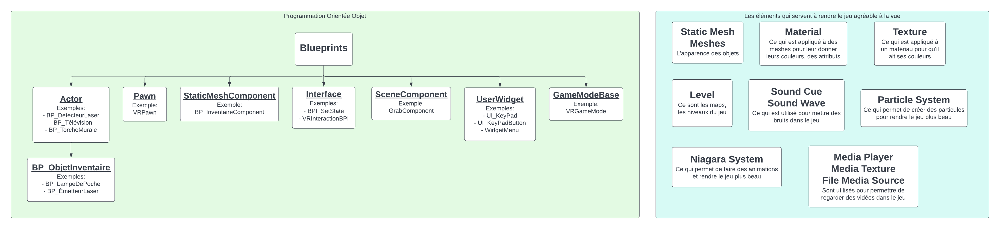

# ProjetSIM_VR
# Titre du jeu : New Super Escape Physics Simulator Legend of Roberta DX Platinum VR Edition
## Projet réalisé par : Guillaume Bordeleau, Jérémy Sinou et William Trépanier

## Description du projet
### L’idée :
L’idée de notre projet est de créer un jeu éducatif pédagogique à caractère scientifique qui vise à vulgariser et démontrer des phénomènes de la physique. Le Game design est basé sur un jeu à genre escape game. L’objectif du jeu est de s’évader d’un château en déverrouillant de multiples pièces. Dans chaque pièce, le joueur sera confronté à une ou des énigmes inédites dans le thème des mathématiques et de la physique. Le joueur pourra explorer un environnement 3D en réalité virtuelle et devra apprendre à interagir avec de nombreux objets tel que, des éléments magnétiques, des blocs subissant une force ou encore des lasers qui reflètent sur des miroirs. Une fois que le joueur réussis à résoudre l’entièreté des énigmes du jeu, il peut enfin sortir du château et il aura complété le jeu. 

### L’utilité :
L’utilité principale de notre projet est d’aider les étudiants à étudier pour leurs cours de physiques durant leurs études collégiales. Ils pourront étudier et apprendre des phénomènes physiques en lien avec leurs différents cours. De plus, la seconde utilité de notre projet est de faire découvrir les phénomènes physiques à tous ceux et celles qui ne s’y connaissent pas en physique. L’accessibilité de notre jeu n’est pas limitée aux étudiants uniquement. L’utilité globale de notre projet est de pouvoir permettre au joueur d’en apprendre davantage sur les phénomènes physiques tout en s’amusant. 

### L’innovation :
Notre jeu serait le premier jeu éducatif complètement en français et qui permettra aux joueurs d’interagir avec des phénomènes physiques en réalité virtuelle dans un jeu de type escape game. C’est un jeu unique en son genre, étant donné qu’aucun jeu accessible au grand public possède les mêmes caractéristiques que le nôtre. De plus, notre jeu pourrait compléter de manière originale les laboratoires vus en classe et de permettre aux étudiants voir ce qui n’est pas possible de voir dans la vie réelle. 

### Cas d’utilisation :
Le premier cas d’utilisation est si un étudiant vient de découvrir de la matière mais qu’il n’a pas bien saisis toute la matière. En retournant chez lui, l’étudiant pourra expérimenter les phénomènes physiques vus en classe et ainsi approfondir sa connaissance en la matière. Le deuxième cas d’utilisation serait pour les élèves en difficulté ou qui apprennent plus facilement de manière visuelle. Ces étudiants pourront observer les phénomènes physiques visuellement, ce qui facilitera leur compréhension. Le troisième cas d’utilisation est pour les personnes qui ne s’y connaissent pas en physique. En jouant au jeu, ils pourront découvrir les phénomènes physiques et apprendre pour la première fois tout en jouant. 

## À qui ça s’adresse :
Ce projet est destiné principalement aux étudiants qui souhaite avoir une autre façon d’assimiler la matière de leurs cours de sciences. L’approche innovante de l’apprentissage par le divertissement peut intéresser beaucoup d’élèves qui ont de la difficulté à suivre leurs cours traditionnels.  
De plus, les niveaux sont également conçus pour un plus large public qui désire simplement découvrir des phénomènes scientifiques de manières originales tout en étant simple à aborder.

### Lien avec les autres matières :
En ce qui concerne les liens avec les autres matières, nous nous basons surtout et nous nous inspirons sur une très large échelle des notions de physiques que nous avons vu en classe. Que ce soit des notions du premier, du second ou du troisième cours de physique, maintes applications physiques seront implémentées dans notre jeu. Par exemple : Utiliser un élément aimanté pour en attirer un deuxième pour activer un bouton pour ouvrir une porte et débloquer le chemin.

## Technologies

### GitHub :
Outils de collaboration permettant de travailler sur un même projet en équipe et de sauvegarder des copies. 

### Unreal Engine 4 :
Moteur de jeu dans lequel on peut éditer et exécuter le projet. Nous utiliserons également les blueprints pour la programmation de notre projet. 

### Unreal Marketplace :
Endroit pour récupérer les assets et les templates nécessaire à la construction du projet. 

### Teams :
Outils de communication et de partage de fichier.

### Blender :
Pour convertir des assets dans le format souhaité afin de les intégrer dans notre projet.

## Assets utilisés
### Maps : 
Factory Environment Collection : https://www.unrealengine.com/marketplace/en-US/product/factory-environment-collection

Spaceship Interior Environment : https://www.unrealengine.com/marketplace/en-US/product/spaceship-interior-environment-set

Modular SciFi Season 2 Starter bundle : https://www.unrealengine.com/marketplace/en-US/product/modular-scifi-season-2-starter-bundle

### Modèles d'objet :

3D Circuit Board model : https://www.turbosquid.com/3d-models/3d-circuit-board-model-1279126?referral=3dmdb

Simple Flashlight : https://free3d.com/3d-model/simple-flashlight-70024.html

attack on titan basement key : https://www.thingiverse.com/thing:360894

Obi Wans Kenobi's Saber 3D : https://www.turbosquid.com/fr/3d-models/obi-wan-lightsaber-3d-1341207

Piédestal modèle 3D : https://www.turbosquid.com/fr/3d-models/free-max-model-architectural-modules/767833

[SSB4] King K. Rool : https://www.thingiverse.com/thing:1078299/files

Tabouret en bois Low-poly modèle 3D : https://www.turbosquid.com/fr/3d-models/3d-wooden-stool-lowpoly-model-1806860

### Inclus par défaut dans la création du projet :

Content Examples : https://www.unrealengine.com/marketplace/en-US/product/content-examples

VrTemplate 4.27.2 : Inclu dans le moteur unreal engine

StarterContent : Inclu dans le moteur unreal engine

## Tutoriels suivis
Afin de se familiariser avec le moteur de jeu Unreal Engine 4, nous avons, en guise de pratique, complétés une liste de lecture qui nous apprends comment programmer un petit jeu. Voici le premier tutoriel que nous avons suivi : https://www.youtube.com/watch?v=mSRov77hNR4&list=PLZlv_N0_O1gYup-gvJtMsgJqnEB_dGiM4

À des fins précises et techniques seulement, nous avons consulté quelques ouvrages de référence dans le domaine : 
- UE4 Virtual Reality Project - Lien : https://cyberlibris-bdeb.proxy.collecto.ca/catalog/book/88869979 
- UE4 Scripting with C++ - Lien : https://cyberlibris-bdeb.proxy.collecto.ca/catalog/book/88867581

Pour en apprendre un peu plus sur la conception et sur l'utilisation des blueprints. Comment interagir avec eux, créer des évènements, les lier à des variables et produire des animations : https://www.unrealengine.com/en-US/onlinelearning-courses/blueprint-kickstart

Apprentissage des concepts essentiels quant à l'utilisation des différents outils qu'offrent UE4 : https://www.unrealengine.com/en-US/onlinelearning-courses/blueprints---essential-concepts

Suivis de tutoriels plus précis en lien avec la réalité virtuelle : https://www.unrealengine.com/en-US/onlinelearning-courses/creating-virtual-reality-walkthroughs

Créer une zone de téléportation qui permettra de passer d'un niveau à un autre.

Ce tutoriel permettra de savoir comment faire: https://youtu.be/asDkS_qDVpI

- Tutoriel permettant de déverrouiller une porte avec une clé portée sur soi : https://youtu.be/29--ieorX7Q

- Tutoriel portant sur des mécanismes d'activation engendré par des boutons : https://youtu.be/q2oyK8FYxOo

- Tutoriel - Création d'un système d'inventaire en VR : https://www.youtube.com/watch?v=1jUtN3S_3Ms

- Tutoriel - Système d'aimants (Magnétisme) : https://www.youtube.com/watch?v=--xR0aQ2rB0

- Tutoriel - Système de lasers (Réflexion|Miroir) : https://youtu.be/EM1MkdDW0Ic

- Tutoriel - Création de matériaux s'apparentant à un miroir : https://youtu.be/sAcqMOX1ruY

- Tutoriel - Implémentation d'un systèeme d'ouverture de portes sécurisées :https://youtu.be/m3DQmi2LUOE | https://youtu.be/B-g6VkRFx_M | https://youtu.be/2N1xGmWY9bU 

- Tutoriel - Simulation d'interférence de la lumière : https://youtu.be/5TV2gSEnIJs

- Tutoriel - Création d'une animation d'arc électrique : https://www.youtube.com/watch?v=SajyFZ35OBI

## Captures d'écrans de notre projet

### Image provenant du niveau de tutoriel:

### Images provenant des maps pour faire des tests:

### Images provenant de la map du niveau 1:

### Images provenant de la map du niveau 3:

## Difficultés rencontrées

- Au début, nous avions de la difficulté avec GitHub, étant donné que nous étions des débutants qui ne connaissaient pas GitHub. Nous avons dû corrompre plusieurs projets avant de comprendre comment GitHub fonctionne et comment utiliser les branches afin de travailler avec GitHub.
- Nous avons dû apprendre à utiliser Unreal Engine à partir de zéro, ce qui nous a demandé beaucoup de temps et d’efforts avant d’être à l’aise avec Unreal avec des tutoriels théoriques. De plus, apprendre à utiliser Unreal Engine a été difficile, étant donné la faible quantité de tutoriels comparativement à d’autres logiciels.
- Un des membres de l’équipe n’avait pas l’équipement nécessaire afin de continuer le développement du projet chez lui, ce qui ralentissait le développement en général.
- Trouver des tutoriels pour apprendre et s’habituer à la réalité virtuelle était compliqué, étant donné que les tutoriels comportaient surtout de la théorie en lien avec la VR. Il fallait également comprendre en peu de temps comment fonctionnait les éléments de la réalité virtuelle afin d’adapter les tutoriels trouvés sur Internet pour les adapter en réalité virtuelle par nous-mêmes.
- Convertir nos idées pour qu’elles deviennent réelles était compliqué, étant donné que nos idées en lien avec des phénomènes physiques sont difficiles à convertir en énigmes et à les programmer en Blueprints.
- Configurer le casque VR en mode développeur pour tester le jeu nativement, configurer l’ordinateur pour qu’il puisse se connecter au casque en mode développeur, configurer Unreal Engine pour le développement sur Android (configurer le projet en APK).

## Échéancier

- Semaine 1 :
Formation de l’équipe, choix du projet
- Semaine 2 :
Recherche d’idées et établissement du thème, familiarisation avec GitHub et le partage de code
- Semaine 3 :
Familiarisation avec Unreal Engine 4 avec des maps tests et tutoriels, continuité de la familiarisation avec GitHub avec des tests, préparation d’une présentation du projet et début de suivis de tutoriels généraux
- Semaine 4 :
Présentation de l’idée générale du projet, continuité des tutoriels généraux
- Semaine 5 :
Continuité des tutoriels sur Unreal Engine 4 en général, écriture du document d’analyse, recherche de références pour davantage d’idées, début du développement du projet
- Semaine 6 :
Familiarisation à la Réalité Virtuelle avec des tutoriels, tutoriels sur des concepts généraux d’Unreal Engine 4 et développement du projet
- Semaine 7 :
Début de la création d’éléments pour le gameplay (Blueprints) à l’aide de tutoriels, développement du projet
- Semaine 8 :
Création d’éléments pour le gameplay (Blueprints) à l’aide de tutoriels, développement du projet
- Semaine 9 :
Création d’éléments pour le gameplay (Blueprints) à l’aide de tutoriels, développement du projet et début de recherche d’assets
- Semaine 10 :
Création d’éléments pour le gameplay (Blueprints) à l’aide de tutoriels, développement du projet, recherche d’assets et début du level design 
- Semaine 11 :
Création d’éléments pour le gameplay (Blueprints) à l’aide de tutoriels, développement du projet, continuité du level design et correction de bugs
- Semaine 12 :
Création d’éléments pour le gameplay (Blueprints) à l’aide de tutoriels, développement du projet, continuité du level design
- Semaine 13 :
Création d’éléments pour le gameplay (Blueprints) à l’aide de tutoriels, développement du projet, continuité du level design et finalisation de la documentation
- Semaine 14 :
Finalisation de la création d’éléments pour le gameplay (Blueprints) à l’aide de tutoriels, finalisation du développement du projet, continuité du level design, phase de débug et préparation pour présentation du projet
- Semaine 15 :
Fin du level design, finaliser le JavaDoc (les commentaires) et remise du projet final

## UML

## Perspectives

•	Explorer plus de phénomènes de physique en général

•	Élaborer davantage les énigmes et en concevoir de nouvelles 

•	Développer plus de niveaux

•	Optimiser encore plus le rendu du jeu pour avoir un meilleur rapport qualité/performances

•	Ajouter plus d’outils de gameplay et intégrer plus de fonctionnalités

•	Configuration du suivi des mains pour améliorer l’immersion

•	Conception de tutoriels plus complets dans le jeu

•	Peaufiner les détails et optimiser l’expérience utilisateur

•	Configuration d’un mode multijoueur

•	Ajout d’éléments de customisation pour le joueur

•	Ajout d’une bande sonore élaborée

## Conclusion

En conclusion, étant donné qu’il s’agissait de notre tout premier projet fait sur Unreal Engine 4 et ce, en réalité virtuelle alors que nous avions d’autres cours à suivre, il est fort probable que nous aurions fait bien mieux si nous avions plus de temps devant nous. Cependant, nous en avons appris énormément sur le développement de jeux en général en accomplissant ce projet. Nous nous sommes amusés à créer un jeu qui nous représente et qui nous plait. Nous sommes fiers de ce premier projet d’envergure qui nous a pris du temps à accomplir, et ce ne sera très probablement pas le dernier!
